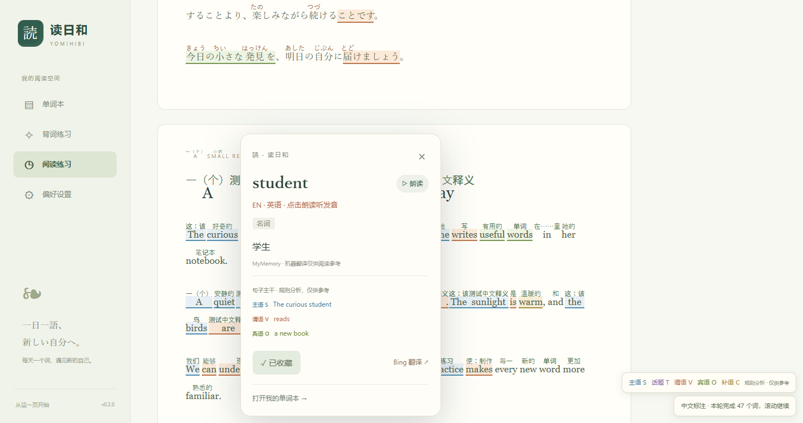
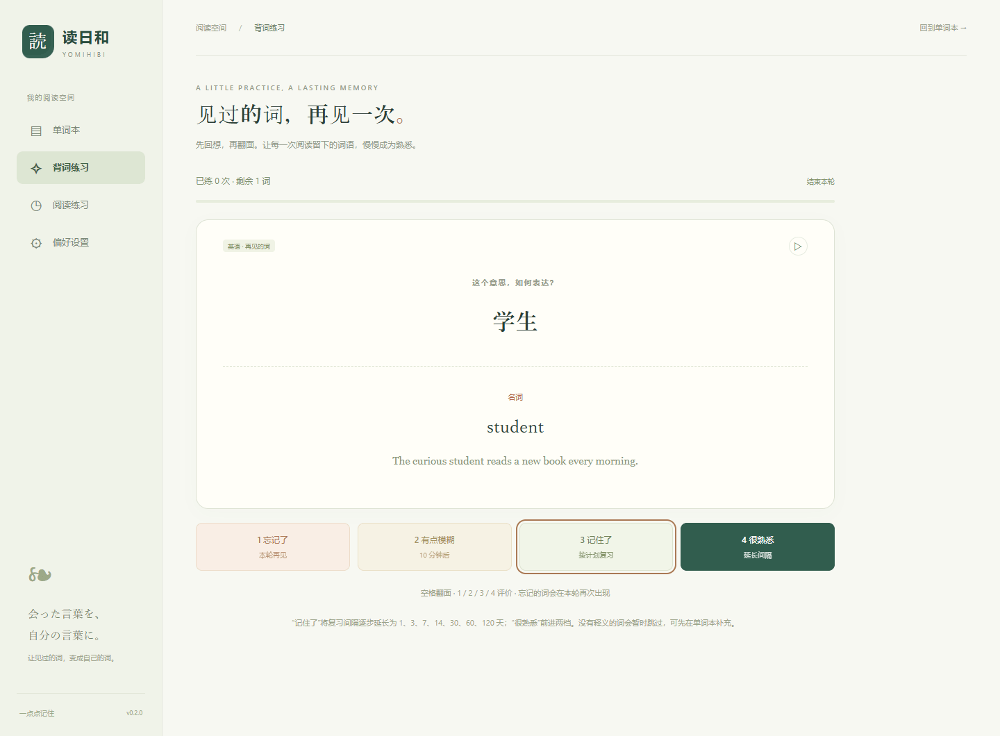

# 读日和 · Yomihibi

**读懂一句，记住一点。**

面向中文使用者的 Chrome / Edge 日英阅读助手。日语假名、主语与句子主干高亮、可选的原文上方中文标注、点击查词收藏，再用翻面卡片复习见过的词。


> 截图使用测试示例词语；实际安装时不会添加演示收藏。

## 第二版的新功能

| 功能 | 日语 | 英语 |
| --- | --- | --- |
| 主语与主干高亮 | 主语 S、话题 T、谓语 V、宾语 O；区分 は 话题和 が 主语 | 主语 S、谓语 V、宾语 O、补语 C |
| 原文上方显示中文 | 独立开关，可与假名同时显示 | 独立开关，逐词中文标注 |
| 点击查词 | 假名、罗马音、原形、词性、中文释义、句子结构摘要 | 英文词语、原形、词性、中文释义、句子结构摘要 |
| 朗读与收藏 | 日语语音，保留原有收藏 | 英语语音，按语言区分收藏 |
| 背词练习 | 到期复习、翻面自测、中文反向回想 | 与日语共用单词本和复习进度 |

假名与主干分析在本地运行。主干来自词性与句型规则，**是候选结构，不是完整句法解析**；复杂从句、倒装和省略可能误判，不会补造日语中省略的主语。网页和查词卡片均提供提示。



## 下载与安装

从 **[Releases 下载最新版](https://github.com/1ATRI/yomihibi/releases/latest)** 的 `yomihibi-v0.2.0.zip`，解压后：

1. Chrome 打开 `chrome://extensions/`；Edge 打开 `edge://extensions/`。
2. 开启「开发者模式」，点击「加载已解压的扩展程序」。
3. 选择**直接包含 `manifest.json` 的目录**，并将读日和固定到工具栏。
4. 打开日文 / 英文网页，点击插件图标开启阅读辅助，或按 `Alt + J`。

目前尚未上架扩展商店。GitHub 自动提供的 Source code ZIP 是源码，需构建后才能加载；Release 单独附带的 ZIP 是可直接加载的扩展。

### 从 0.1.0 升级

先在单词本导出 JSON 备份。将新版扩展文件覆盖到**原来加载的同一个目录**，在扩展管理页点击刷新，再刷新网页。不要先卸载插件；卸载会清除本地收藏。若改用新目录产生不同扩展 ID，可导入备份恢复。

0.1.0 收藏默认归为日语，原有 ID、释义、笔记和掌握状态保持；新版本能导入 v1 / v2 备份。v2 备份额外保存语言和复习进度。

## 怎么用

- **自动 / 日语 / 英语**：弹窗可选择处理语言。自动模式利用字符与页面语言提示判断；识别不合适时可手动选择。
- **高亮**：主语 / 话题和谓语 / 宾补语分别开关，查词卡片显示所在句的候选主干。
- **中文标注**：日语、英语各一个开关，默认关闭。开启后将可见区域中的不同词语逐个发送给翻译服务；单词重复时复用结果，每轮最多 120 个请求，达到上限可在网页点击「继续」。错误时暂停，可重试。逐词释义不等于整句翻译。
- **单词本**：按语言、学习状态和关键词筛选，编辑笔记 / 释义，保存原文片段和来源。
- **背词**：选择语言、到期 / 全部、正向 / 反向和本轮数量；空格翻面，1～4 评价。忘记的词本轮重现，记住的词按间隔排到未来。



复习间隔按档位为 1、3、7、14、30、60、120 天；「很熟悉」前进两档，「有点模糊」10 分钟后，「忘记了」1 分钟后到期并在本轮再次出现。没有释义的词暂时跳过。手动标记「已掌握」的词不进入到期队列，仍可在「全部」中练习。

## 翻译、朗读和隐私

- 默认 **MyMemory**：免费免密钥，有服务配额和频率限制。
- **Microsoft Translator**：使用你自己的 Azure Translator 密钥与资源区域；日语 / 英语分别设为来源语言，目标简体中文。
- **Bing 网页模式**：点击卡片中的链接查看翻译，不支持自动行间中文标注。

普通查词只发送点击词语的原形；开启行间中文后，会发送可见内容中被标注词语的原形，不发送整页原文、原文 URL、笔记或收藏例句。语法分析不调用网络。密钥只保存在扩展本地存储，不写入导出文件或网页。朗读依赖已安装的对应语言语音，缺少时会提示。

收藏和复习进度保存在此浏览器，最多 5000 词，不跨设备同步。请定期导出 JSON；CSV 可供 Excel / Anki 字段映射使用。详见 [隐私说明](docs/PRIVACY.md)。

## 本地开发

需要 Node.js 22.12+ 和 npm。

```bash
git clone https://github.com/1ATRI/yomihibi.git
cd yomihibi
npm ci
npm run build
```

在扩展管理页加载 `dist/`。修改后重新构建、刷新扩展，再刷新阅读网页。

```bash
npm test
npx playwright install chromium
npm run test:e2e
npm run package
```

输出 `artifacts/yomihibi-v0.2.0.zip`。自动测试使用隔离 Chromium 配置，实际运行扩展与词典，外部翻译采用模拟响应；不会访问日常浏览器数据。

## 文档与边界

- [使用与升级指南](docs/USER_GUIDE.md)
- [项目功能与规划](docs/PROJECT.md)
- [架构和消息协议](docs/ARCHITECTURE.md)
- [背词调度说明](docs/REVIEW.md)
- [测试范围](docs/TESTING.md)
- [贡献指南](CONTRIBUTING.md) / [更新记录](CHANGELOG.md)

文本节点是分词边界；跨标签词语或句子可能分析不完整。人名、多音字、新词会影响日语注音。图片、PDF、浏览器内置页面、扩展商店、跨域 iframe、Shadow DOM 内文暂不处理。高度动态页面可能需要重新开启或刷新。链接上普通点击查词，Ctrl / ⌘ + 点击保留原链接行为。Firefox 暂未适配。

## 致谢与许可

项目代码采用 [MIT License](LICENSE)。构建包 `licenses/` 包含依赖的许可与词典声明：

- [Kuromoji.js / IPADIC](https://github.com/takuyaa/kuromoji.js) — 日语分词与词典，Apache-2.0 / IPADIC NOTICE。
- [Compromise](https://github.com/spencermountain/compromise) — 英语词性、词组与动词分析，MIT。
- [WanaKana](https://github.com/WaniKani/WanaKana)、[fflate](https://github.com/101arrowz/fflate)、[doublearray](https://github.com/takuyaa/doublearray) — MIT。

接口依据：[Chrome activeTab](https://developer.chrome.com/docs/extensions/develop/concepts/activeTab)、[MyMemory](https://mymemory.translated.net/doc/spec.php)、[Microsoft Translator](https://learn.microsoft.com/azure/ai-services/translator/text-translation/reference/v3/translate)。
