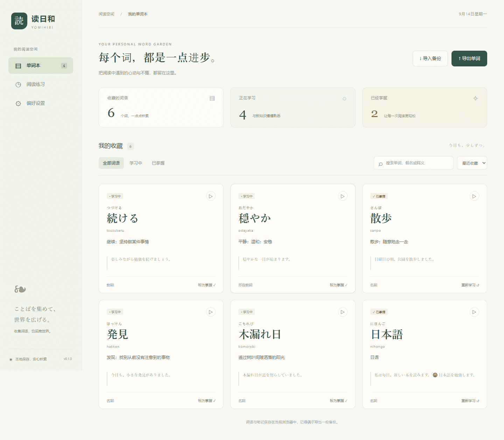
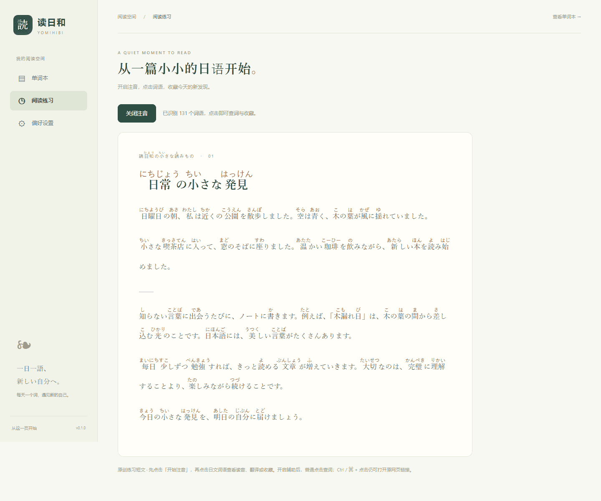
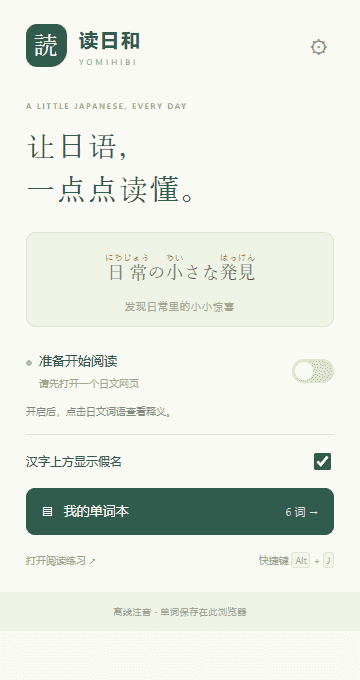

# 读日和 · Yomihibi

**让日语，一点点读懂。**

面向中文使用者的 Chrome / Edge 日语阅读辅助扩展：网页汉字上方显示假名，点击词语查看读音与中文翻译，再将遇见的词语收藏到自己的单词本。



> 截图中的示例词语仅用于展示；首次安装的单词本为空，不会添加演示数据。

## 下载与安装

前往 **[Releases 下载最新版安装包](https://github.com/1ATRI/yomihibi/releases/latest)**，下载 `yomihibi-v0.1.0.zip` 并解压。

1. Chrome 打开 `chrome://extensions/`；Edge 打开 `edge://extensions/`。
2. 开启页面中的「开发者模式」。
3. 点击「加载已解压的扩展程序」，选择解压后**直接包含 `manifest.json` 的目录**。
4. 将「读日和」固定到浏览器工具栏。
5. 打开日文网页，点击插件图标，开启「当前页面阅读辅助」。也可按 `Alt + J`。

目前通过开发者模式加载，尚未上架浏览器扩展商店。下载仓库的 Source code ZIP 是源码，需先构建；Release 中单独附带的 `yomihibi-v0.1.0.zip` 才是可直接加载的插件。

详细图文入口：[使用指南](docs/USER_GUIDE.md)。

## 已实现功能

| 功能 | 说明 |
| --- | --- |
| 汉字假名注音 | 内置 Kuromoji / IPADIC 词典，分词与注音完全离线；用原生 `<ruby>` 显示平假名 |
| 送假名对齐 | 例如 `読みます` 只给 `読` 标 `よ`，尽量保留原文阅读节奏 |
| 点击查词 | 显示词语、假名、罗马音、词性、原形、中文机器翻译 |
| 日语朗读 | 使用浏览器或系统的日语语音；缺少语音时给出提示 |
| 多种翻译方式 | 默认 MyMemory 免密钥；可配置 Microsoft Translator 官方接口；始终提供 Bing 网页链接 |
| 单词收藏页 | 收藏词语、释义、例句和原文来源；支持假名 / 中文 / 罗马音搜索 |
| 学习管理 | 学习中 / 已掌握切换、笔记编辑、补充释义、删除与分页 |
| 备份与导出 | JSON 完整导入导出，CSV 导出供 Excel / Anki 等工具使用 |
| 阅读偏好 | 假名开关、字号调节；设置可更新到已经开启的网页 |
| 动态内容 | 监测新加入的网页文本，分批注音；关闭后恢复文本 |
| 内置练习 | 一篇原创日语短文，可直接体验注音与收藏 |

## 翻译服务

- **MyMemory（默认）**：不用注册或填密钥，联网即可尝试查词。有服务端额度和频率限制，网络、短词和上下文不足都会影响结果。
- **Microsoft Translator**：设置中填写自己的 Azure Translator 密钥和区域，使用微软官方接口。计费与配额由你的 Azure 资源决定。本项目不提供公共密钥。
- **Bing 网页模式**：不自动请求在线翻译，点击查词卡片内的链接，在 Bing 网页查看释义和朗读。

微软官方接口与 Bing 网页入口是两种接入方式；项目没有抓取 Bing 内部令牌。仅查词时向所选服务发送该词原形，不发送整页、例句或网址。在线结果是机器翻译，不是权威词典。发音来自系统 / 浏览器语音。

## 界面





## 本地开发

需要 Node.js 22+ 和 npm。

```bash
git clone https://github.com/1ATRI/yomihibi.git
cd yomihibi
npm ci
npm run build
```

构建产物位于 `dist/`；在浏览器「加载已解压的扩展程序」中选择它。源码或配置修改后，重新构建并在扩展管理页面点击刷新，然后刷新待阅读网页。

```bash
npm test                       # 核心逻辑 + 真实 IPADIC 词典测试
npx playwright install chromium
npm run test:e2e                # 真实扩展环境的浏览器测试
npm run package                 # 构建并生成 artifacts/yomihibi-v0.1.0.zip
```

端到端测试使用隔离浏览器配置，不读取日常浏览器收藏或登录态；外部翻译响应采用模拟数据。测试副本只额外获得本机 HTTP 测试页面的权限，发布包仍使用 `activeTab` 临时授权，不请求所有网站访问权。

## 项目文档

- [使用指南与常见问题](docs/USER_GUIDE.md)
- [功能与版本规划](docs/PROJECT.md)
- [架构、消息协议和开发说明](docs/ARCHITECTURE.md)
- [隐私与权限说明](docs/PRIVACY.md)
- [测试范围和已知限制](docs/TESTING.md)
- [贡献指南](CONTRIBUTING.md)
- [更新记录](CHANGELOG.md)

## 已知边界

人名、多音字、新词、跨 DOM 节点的词语可能误分词或误注音。扩展只处理当前页面可访问的 DOM 文字；图片、浏览器内置 PDF、扩展商店、浏览器设置页、跨域 iframe、封闭 Shadow DOM 不在当前支持范围。高度动态的页面可能需要刷新后重新开启。链接上的普通点击查词，`Ctrl / ⌘ + 点击` 保留原链接行为。

收藏保存在当前浏览器，最多 5000 词，不跨设备同步；卸载或清理扩展数据前请导出备份。Firefox 暂未适配。

## 致谢与许可

本项目代码采用 [MIT License](LICENSE)。随包使用的第三方代码和词典遵循各自许可，构建结果中的 `licenses/` 保留完整文本：

- [Kuromoji.js](https://github.com/takuyaa/kuromoji.js) — Apache-2.0
- [IPADIC](https://github.com/takuyaa/kuromoji.js/blob/master/NOTICE.md) — 词典许可见 NOTICE
- [WanaKana](https://github.com/WaniKani/WanaKana) — MIT
- [fflate](https://github.com/101arrowz/fflate) — MIT
- [doublearray](https://github.com/takuyaa/doublearray) — MIT

浏览器实现依据 [Chrome activeTab 文档](https://developer.chrome.com/docs/extensions/develop/concepts/activeTab) 与 [跨域请求文档](https://developer.chrome.com/docs/extensions/develop/concepts/network-requests)。翻译接入参考 [MyMemory 文档](https://mymemory.translated.net/doc/spec.php) 与 [微软 Translator 文档](https://learn.microsoft.com/azure/ai-services/translator/text-translation/reference/v3/translate)。
