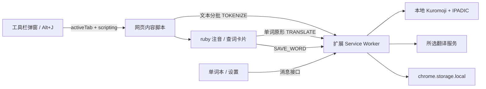

# 开发与架构

## 技术组成

Manifest V3，原生 JavaScript / HTML / CSS，esbuild 打包。Kuromoji 负责形态素分析，IPADIC 随包发布；WanaKana 转换假名与罗马音；fflate 解压词典和生成发行 ZIP。所有可执行代码随包发布，不使用远程脚本或 eval。



## 目录

```text
manifest.json             权限、工作线程、弹窗、快捷键
public/                   静态 HTML 页面
src/background.js         消息路由、权限边界、翻译缓存、串行存储写入
src/tokenizer.js          fetch 本地词典 + gzip 解压 + Kuromoji 装载
src/content.js            DOM 扫描、动态观察、ruby、查词卡片
src/translation.js        MyMemory / Microsoft / Bing 模式
src/shared/               日文工具、数据校验、界面帮助函数
src/styles/               插件页面样式和卡片 Shadow DOM 样式
src/popup.js               当前页面控制
src/vocabulary.js          单词搜索、笔记、学习状态、备份
src/settings.js            偏好设置
src/demo.js                内置练习的本地控制适配
scripts/                   构建与 ZIP 打包
tests/                     单元测试与浏览器集成测试
docs/                      项目文档与界面截图
dist/                      生成的可加载扩展，不提交源码仓库
artifacts/                 安装 ZIP 和测试产物，不提交源码仓库
```

## 注音过程

用户操作获得当前页临时权限，工作线程注入脚本和 CSS。内容脚本扫描文字，跳过输入框、可编辑节点、代码、现成 ruby、隐藏属性区域等。每次请求最多 40 个节点、约 12000 UTF-16 码元；超过 4000 码元的文本节点先拆分，不拆开代理对。工作线程接口另有限制：最多 80 条文本和 16000 码元。

词典初始化用共享 Promise，后续请求重用。MV3 工作线程被浏览器回收后，下次请求会重新加载词典。每条文本的分词结果拼接必须与原文一致才替换，避免丢失空白、emoji 或其他符号。

`rubyParts` 将汉字组与假名锚点对齐，尽可能只为汉字标注。找不到合理对齐时以整词注音兜底；没有词典读音时保留原文。

生成节点的 token 数据存于 WeakMap。MutationObserver 处理新增 / 更新区域，应用自己的 DOM 改动时暂时断开观察，防止循环。关闭注音时先去掉自建 rt，再恢复生成容器内的当前文字，避免用旧快照覆盖网页改动。

查词界面使用 Shadow DOM 隔离样式。来自词语、网页、翻译、收藏的数据以文本节点显示。翻译中的 HTML 实体用脱离文档的 textarea 解码，不把结果作为可执行 HTML 插入页面。

## 消息协议

请求：`{ type, ...data }`；结果：`{ ok: true, data }` 或 `{ ok: false, error }`。

| 类型 | 用途 | 调用范围 |
| --- | --- | --- |
| TOKENIZE | 分词与读音 | 内容脚本 / 扩展页 |
| TRANSLATE | 固定服务的单词翻译 | 内容脚本 / 扩展页 |
| HAS_WORD / SAVE_WORD | 检查与收藏 | 内容脚本 / 扩展页 |
| SPEAK / OPEN_VOCAB | 朗读 / 打开单词本 | 内容脚本 / 扩展页 |
| GET_SETTINGS / SAVE_SETTINGS | 含密钥的配置 | 仅扩展页 |
| GET_WORDS / UPDATE_WORD / DELETE_WORD / IMPORT_WORDS | 本地单词本管理 | 仅扩展页 |
| TOGGLE_TAB / PAGE_STATE | 控制当前网页 | 仅扩展页 |
| YH_SET / YH_STATUS / YH_PREFERENCES | 扩展到内容脚本 | 校验 sender.id |

无 `onMessageExternal`，不暴露可任意 fetch URL 的接口。存储访问级别为 TRUSTED_CONTEXTS；带密钥设置不能传回内容脚本，只广播公开显示偏好。

## 单词数据

```js
{
  id: "読む␟よむ", // 原形 + U+241F + 读音
  surface: "読む", base: "読む", reading: "よむ", romaji: "yomu",
  pos: "動詞", meaning: "读；阅读", provider: "MyMemory",
  sentence: "私は本を読む。", sourceTitle: "原页面标题",
  sourceUrl: "https://example.com/article", note: "自己的笔记",
  mastered: false, createdAt: 1789380000000
}
```

同一原形和读音去重；不同活用读音可能保留为不同卡片。所有存储修改进入串行队列，避免多个标签页同时收藏时丢失更新。导入逐条校验、限制字段长度和条数，原文链接只接受 HTTP / HTTPS，未知字段被丢弃。CSV 对可能成为公式的字段加前导单引号。

JSON 导出格式为 `{ app: 'yomihibi', version: 1, exportedAt, words }`。导入采取合并并保留已存在条目的方式，不覆盖笔记。

## 翻译与朗读

MyMemory 使用 GET `q` / `langpair=ja|zh-CN`。微软使用 POST `translate?api-version=3.0&from=ja&to=zh-Hans`，密钥和区域放请求头。查询最多 100 字，12 秒超时，内存中缓存最多 300 项，对相同在途请求复用 Promise；不缓存失败。

朗读通过 `chrome.tts` 查找 `ja` 开头的语音。缺少日语语音会返回明确提示，不声称提供了离线 TTS 模型。

## 构建与发布

`npm ci` 安装锁定依赖，`npm run build` 构建 `dist/`，复制词典与第三方许可并生成 PNG 图标。`npm run package` 将 dist 内容直接放入 ZIP 根目录。

GitHub Actions 在 push / PR 上执行单元与 Chromium 测试并构建产物。创建 GitHub Release 后，发布工作流从对应版本标签构建 ZIP 并附加为发行资产。首次安装请使用 Release 资产而非源码压缩包。
