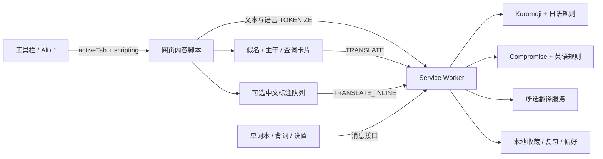

# 开发与架构

## 技术组成

Manifest V3，原生 JavaScript / HTML / CSS，esbuild 打包。Kuromoji / IPADIC 提供日语形态素与读音，WanaKana 转换假名和罗马音，Compromise 提供英语词性、词形和短语信息，fflate 解压词典与打包。所有可执行代码随包发布，不使用远程脚本或 eval。



## 目录

| 文件 | 职责 |
| --- | --- |
| `manifest.json` | 权限、工作线程、弹窗、快捷键 |
| `src/background.js` | 消息边界、翻译缓存、串行存储修改 |
| `src/tokenizer.js` | 读取随包词典、gzip 解压与 Kuromoji 装载 |
| `src/analysis/` | 日语话题 / 主语 / 主干规则、英语词形与角色分析 |
| `src/content.js` / `content.css` | DOM 扫描、语言识别、动态观察、标注与查词 |
| `src/inline.js` | 可见词语中文标注队列、复用、限额与暂停 |
| `src/translation.js` | 日英到中文的 MyMemory / Microsoft 请求，Bing 模式 |
| `src/shared/` | 数据校验、语言与假名工具、复习调度、界面帮助函数 |
| `src/review.js` | 背词队列、翻面、评分、快捷键与结果页 |
| `src/vocabulary.js` | 语言筛选、搜索、笔记、学习状态、备份 |
| `src/popup.js` / `settings.js` / `demo.js` | 当前页控制、偏好、内置练习 |
| `public/` / `src/styles/` | 静态 HTML 与样式 |
| `scripts/` / `tests/` / `docs/` | 构建、测试与文档 |
| `dist/` / `artifacts/` | 生成的扩展、安装 ZIP、测试产物，不提交源码仓库 |

## 分析与渲染

自动识别以文本节点的字符和最近的 `lang` 属性为依据，避免将中文汉字直接当作日文；用户可手动选择语言。每次内容脚本请求最多 40 个节点、约 12000 UTF-16 码元，超 4000 码元的节点先拆分，不拆代理对。工作线程上限为 80 条 / 16000 码元。日语词典初始化使用共享 Promise，MV3 工作线程回收后会重新加载。

日语规则区分 は 话题与 が 主语，标注 を 宾语及句末谓语；不会为省略主语补造人物。英语根据词性与短语信息识别主语和谓语，并保守选择宾语或补语。两者都是候选主干，复杂从句、倒装、引用、歧义和跨节点句子可能不准确，不是完整依存句法分析器。

分词后必须能精确拼回原文才替换节点，保留空白、标点和 emoji。`rubyParts` 对齐汉字与送假名，无法对齐时整词注音。原形用于查词和去重；token 的角色、句子及候选主干存入 WeakMap。日文假名和可选中文分别使用 `.yh-kana`、`.yh-zh`，隐藏假名不影响中文。

MutationObserver 处理新增 / 更新区域。自身 DOM 替换期间断开观察，生成容器被扫描规则跳过。关闭时删除自建 rt 后恢复容器里的当前文字，避免旧快照覆盖网页更新。语言切换用 generation 序号丢弃旧异步结果，恢复原文再分析。

查词卡片、图例和中文查询提示位于 Shadow DOM，来自网页、翻译和收藏的数据均作为文本显示。HTML 实体在脱离文档的 textarea 中解码，不作为可执行 HTML 插入。

## 中文标注队列

两个语言开关默认关闭。IntersectionObserver 观察视口及 80px 邻近区域；按服务 / 语言 / 原形去重。每页最多同时两个请求，调度间隔约 300ms，每轮 120 次额度，用户可继续追加 120 次。失败暂停，按钮重试；关闭或偏好改变后用 epoch 丢弃在途旧结果。

工作线程还会校验对应语言开关和服务，Bing 模式拒绝自动标注。翻译缓存上限为工作线程 800 项、页面 1000 项。同一在途查询复用 Promise；失败不缓存。关闭开关不能撤回已经发送的请求。

## 消息协议与边界

请求 `{ type, ...data }`，结果 `{ ok: true, data }` 或 `{ ok: false, error }`。

| 类型 | 用途 | 调用范围 |
| --- | --- | --- |
| TOKENIZE | texts 和可选 languages 数组，返回带语言 / 角色的 tokens | 内容脚本 / 扩展页 |
| TRANSLATE / TRANSLATE_INLINE | 点击查词 / 已开启的中文标注 | 内容脚本 / 扩展页 |
| HAS_WORD / SAVE_WORD | 检查与收藏 | 内容脚本 / 扩展页 |
| SPEAK / OPEN_VOCAB | 按语言朗读 / 打开单词本 | 内容脚本 / 扩展页 |
| GET_SETTINGS / SAVE_SETTINGS | 含密钥配置；保存时合并已有配置 | 仅扩展页 |
| GET_WORDS / UPDATE_WORD / DELETE_WORD / IMPORT_WORDS | 收藏管理 | 仅扩展页 |
| REVIEW_WORD | 单词 ID、评价、reviewId，返回已保存单词 | 仅扩展页 |
| TOGGLE_TAB / PAGE_STATE | 当前网页控制 | 仅扩展页 |
| YH_SET / YH_STATUS / YH_PREFERENCES | 扩展向内容脚本发送状态或公开偏好 | 校验 sender.id |

无 onMessageExternal，无任意 URL 抓取接口。存储权限为 TRUSTED_CONTEXTS；密钥不进入网页，仅广播公开偏好。

## 收藏与复习数据

```js
{
  id: "en␟read", language: "en", // 日语沿用原形 + ␟ + 读音的旧 ID
  surface: "reads", base: "read", reading: "", romaji: "",
  pos: "动词", meaning: "阅读", provider: "MyMemory",
  sentence: "She reads a book.", sourceTitle: "原页面标题",
  sourceUrl: "https://example.com/article", note: "自己的笔记",
  mastered: false, createdAt: 1789380000000,
  review: { stage: 1, dueAt: 1789466400000, lastReviewedAt: 1789380000000,
    reviews: 1, lapses: 0, lastReviewId: "评分去重标识" }
}
```

旧记录没有 language 时按日语读取，无 review 时视为未复习，保留旧 ID 和笔记。所有存储修改进入串行队列。复习时间由工作线程计算，最近一次相同 reviewId 重试不重复评分。调度和边界见[背词说明](REVIEW.md)。

JSON 导出 `{ app: 'yomihibi', version: 2, exportedAt, words }`，可导入 v1 / v2；合并时保留已有同 ID 记录，不覆盖其笔记或复习进度。字段长度、数量和复习数值均校验，来源链接只接受 HTTP / HTTPS，CSV 防止公式注入。密钥不参与导出。

## 翻译、语音与发布

MyMemory 使用 GET q / langpair=ja|zh-CN 或 en|zh-CN。微软 POST 使用 from=ja 或 en、to=zh-Hans，密钥及区域在请求头。查询上限 100 字，12 秒超时。朗读使用 chrome.tts 查找对应语言语音，缺少语音会提示。

`npm ci` 安装锁定依赖，`npm run build` 构建 dist 并复制词典、许可与图标；`npm run package` 将 dist 内容放入 ZIP 根目录。GitHub Actions 在 push / PR 执行单元、Chromium 测试与构建；发布工作流从版本标签构建并上传 ZIP。安装应使用 Release 的扩展 ZIP。
